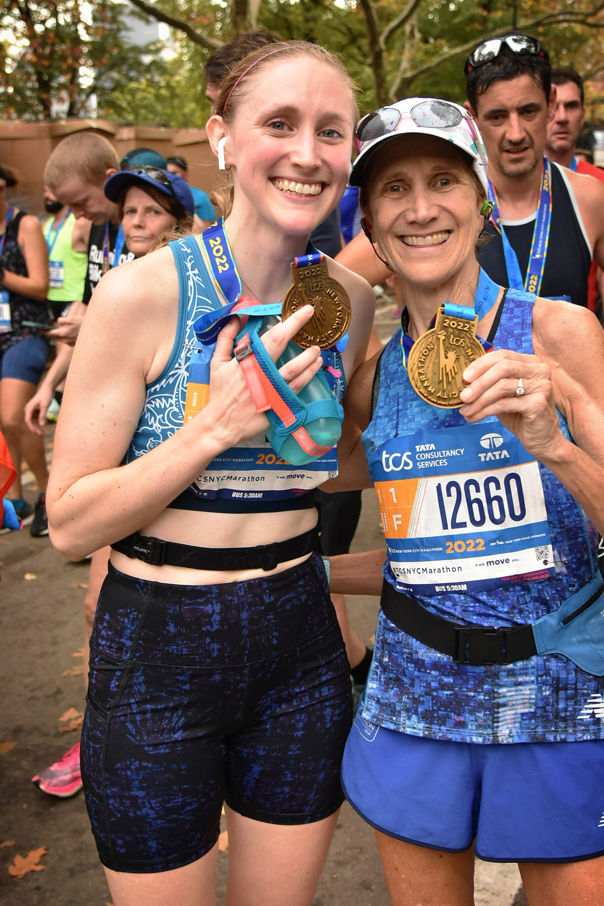
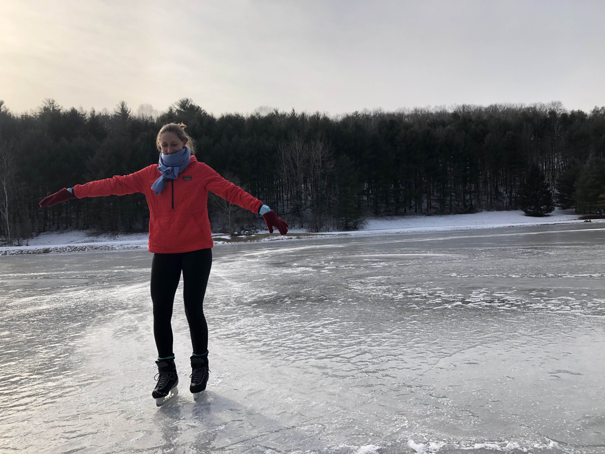
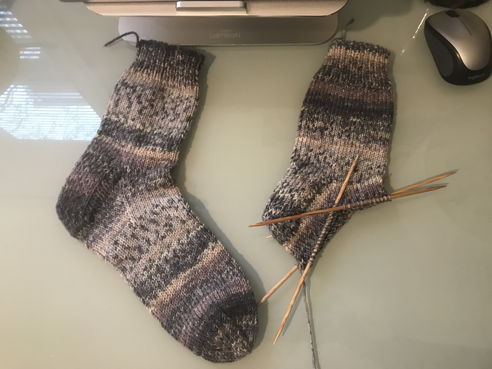
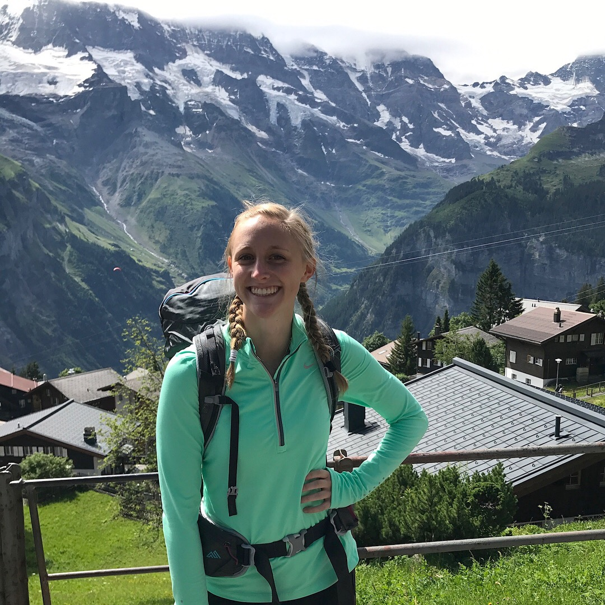

### Running  

I've been an athletic individual for a majority of my life. Growing up, I was constantly playing soccer or basketball, running track & field, or dancing. Throughout high school and into college, I became more interested in sprinting and hurdling on the track & field team. After graduating, however, I started to follow more in my mom's steps of being a long-distance runner. Most recently, I had the wonderful opportunity to run my first marathon at the New York City Marathon, finishing with my mom by my side.

{width=50%}

### Ice Skating  
Living in Boston during the beginning of the COVID-19 pandemic, feeling the pull to try new things and expand my horizons, I decided to try to teach myself how to ice skate. One quick Black Friday purchase later, I now have a pair of my own skates and consistently find peace and comfort at the rink, wherever it may be. 

{width=70%}

### Knitting  

I was taught how to knit by a family friend at a very young age. At that time, I spent hours making a very long and uniquely shaped scarf. After taking a multi-year sabbatical from knitting, I felt the need for a creative outlet that would challenge me and engage my mind. Now, I frequently make various knit items, ranging from scarfs and socks to hats and blankets. I typically make knit goods for close friends and family since I enjoy the feeling of creating a stronger and more intentional friendship through gifting handmade items. 

{width=50%}

### Traveling 

Prior to COVID-19, I had the great privilege and ability to travel. One of my favorite experiences was hut-to-hut backpacking in the Swiss Alps with a small group of my classmates during the summer of 2017 (pictured here). Whether it's across state or nation lines, being able to experience different cultures and see the world through a new lens has significantly contributed to how I interact with people and places around me.

{width=70%}

